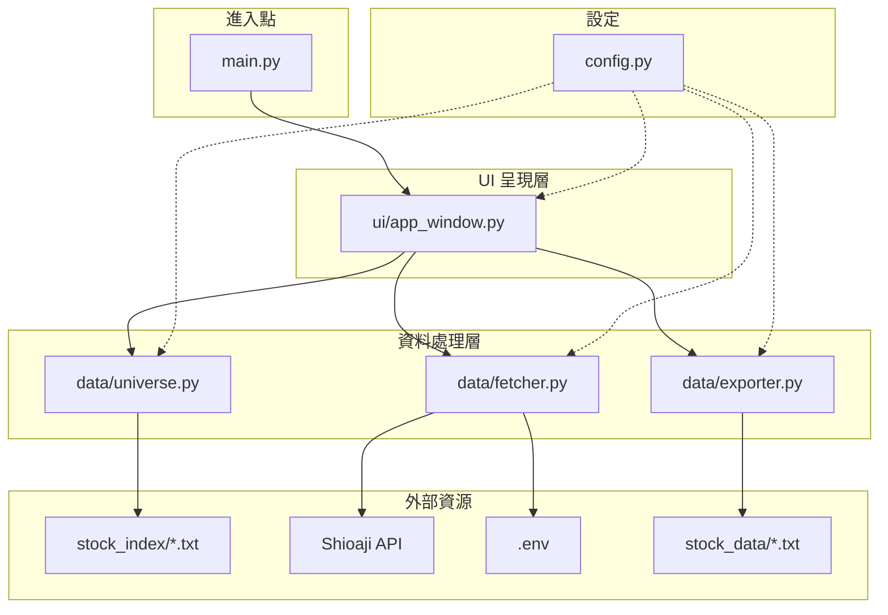
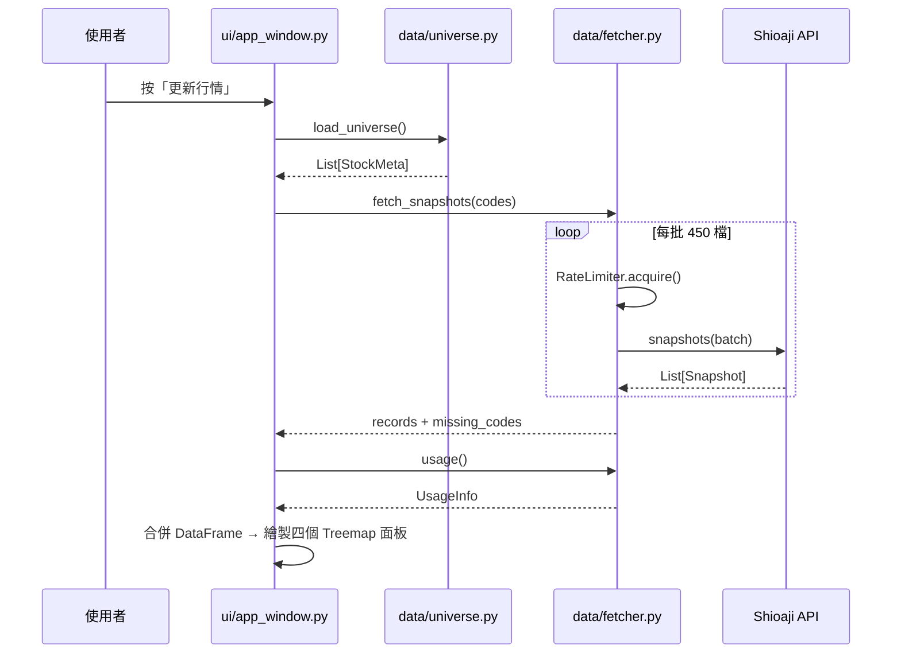
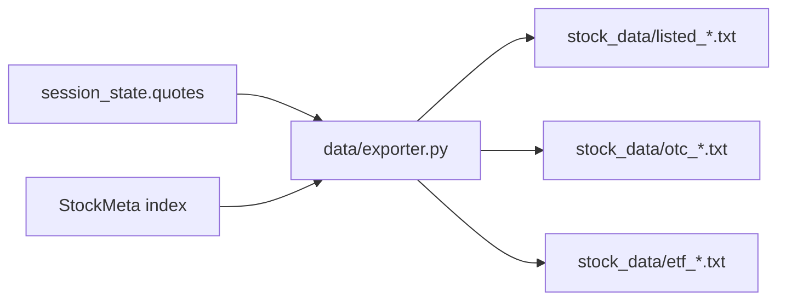
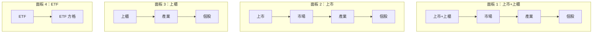
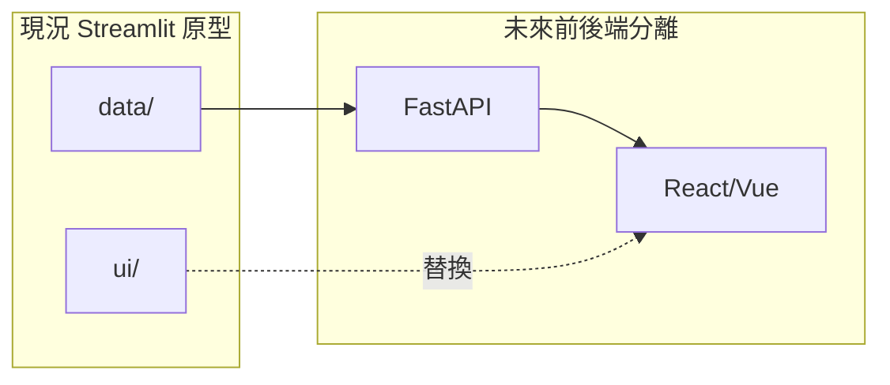

# 台股 Treemap 系統架構說明

本文件描述 `tw_stock_treemap` 專案的整體架構、模組職責與資料流向，供開發與除錯參考。

---

## 1. 系統目標

串接永豐金 **Shioaji API**，讀取 `stock_index/` 內全市場標的清單（上市、上櫃、ETF），取得即時行情並以 **Plotly Treemap** 熱力圖呈現。資料採集具備限流防禦，UI 與資料層完全解耦，方便未來遷移至 React/Vue + FastAPI。

---

## 2. 目錄結構

```
stock_treemap/
│
├── main.py                 # 進入點：啟動 Streamlit Debug UI
├── config.py               # 全域設定（路徑、限流參數、Treemap 配色）
│
├── data/                   # 【資料處理層】
│   ├── __init__.py
│   ├── universe.py         # 職責：解析 stock_index 清單 → StockMeta
│   ├── fetcher.py          # 職責：Shioaji 登入、分批 snapshots、限流
│   └── exporter.py         # 職責：格式化行情並匯出 .txt
│
├── ui/                     # 【UI 呈現層】
│   ├── __init__.py
│   └── app_window.py       # 職責：Streamlit 介面、Plotly Treemap 渲染
│
├── doc/                    # 【文件】
│   ├── ARCHITECTURE.md     # 本文件：系統架構說明
│   └── USAGE.md            # 使用說明（安裝、操作、常見問題）
│
├── stock_index/            # 【靜態輸入】上市 / 上櫃 / ETF 清單（.txt）
├── stock_data/             # 【動態輸出】匯出的行情 .txt（依時間與分類）
│
├── .env                    # API 金鑰（不進版控）
├── environment.yml         # conda 環境定義（sinotrade）
└── sino_API*.md            # Shioaji API 參考文件
```

---

## 3. 分層架構



**設計原則：**

| 原則 | 說明 |
|------|------|
| 單一職責 (SRP) | 每個模組只做一件事：抓資料、匯出、渲染 UI |
| 解耦 (Decoupling) | `ui/` 不直接呼叫 Shioaji，只透過 `data/` 取得資料 |
| 設定集中 | 路徑、限流、配色統一在 `config.py` |

---

## 4. 模組職責

### 4.1 `main.py` — 進入點

- 唯一職責：呼叫 `ui.app_window.render()` 啟動 Streamlit
- 啟動指令：`streamlit run main.py`

### 4.2 `config.py` — 全域設定

| 類別 | 內容 |
|------|------|
| 路徑 | `STOCK_INDEX_DIR`、`STOCK_DATA_DIR`、三份清單檔路徑 |
| 限流 | 每批 450 檔、5 秒 ≤40 次、批間 sleep 0.1s |
| UI | Treemap 紅漲綠跌配色、自動刷新最小 15 秒 |
| 流量警戒 | 剩餘 < 50MB 時 UI 警告 |

### 4.3 `data/universe.py` — 標的宇宙

```
stock_index/*.txt  →  StockMeta(code, name, market, industry, kind)
                              ↓
                     category_of() → listed | otc | etf
```

- 解析 tab 分隔清單，支援 UTF-8 / Big5
- 依代號去重，目前約 **2,185** 檔

### 4.4 `data/fetcher.py` — 資料抓取

| 類別 | 說明 |
|------|------|
| `RateLimiter` | 滑動視窗速率限制（deque + Lock） |
| `ShioajiFetcher` | 登入、解析商品檔、分批 snapshots、流量查詢 |
| `UsageInfo` | 封裝 `api.usage()` 回傳的 bytes / 上限 / 剩餘 |

**防禦重點：**

- `Contracts.Stocks[code]` 可能回傳 `None`，必須過濾
- snapshots 一次最多 500 檔，本系統用 450 保留邊際
- 行情查詢 5 秒上限 50 次，本系統用 40 保留邊際

### 4.5 `data/exporter.py` — 資料匯出

- 依 `category_of()` 分類
- 輸出路徑：`stock_data/{listed|otc|etf}_{YYYYMMDD_HHMMSS}.txt`
- 空類別不產檔

### 4.6 `ui/app_window.py` — 介面呈現

| 功能 | 實作 |
|------|------|
| API 連線 | `@st.cache_resource` 整 session 只登入一次 |
| 行情快取 | `st.session_state.quotes` |
| 側欄控制 | 市場篩選、大小指標、手動/自動刷新、流量顯示、匯出 |
| 資料合併 | `_merge_quotes()` 將 snapshots 與 `StockMeta` 合併，附加 `category` 欄 |
| Treemap | 四個獨立面板，由 `_render_treemap_panel()` 依 `category` 篩選後繪製 |

**Treemap 繪製流程：**

```
session_state.quotes + StockMeta
        ↓
_merge_quotes() → DataFrame（含 category）
        ↓
_render_treemap_panel() × 4（依 category 篩選）
        ↓
_build_treemap() → Plotly px.treemap
```

方格標籤透過 `custom_data` 顯示三行：**名稱 / 現價 / 漲跌幅**；方格過小時以 `uniformtext_mode="hide"` 自動隱藏文字。

---

## 5. 資料流程

### 5.1 抓取行情（手動或自動刷新）



### 5.2 匯出 .txt



---

## 6. Treemap 視覺規格

主畫面依序顯示 **四個獨立 Treemap 面板**，共用同一批行情資料，但各自依 `category` 篩選並使用不同的分層 `path`：

| # | 面板標題 | 篩選條件 | 分層 path |
|---|----------|----------|-----------|
| 1 | 上市 + 上櫃股票 | `listed`, `otc` | 根 → 市場 → 產業 → 名稱 |
| 2 | 上市股票 | `listed` | 根 → 市場 → 產業 → 名稱 |
| 3 | 上櫃股票 | `otc` | 根 → 產業 → 名稱 |
| 4 | ETF | `etf` | 根 → 名稱 |



每個面板上方顯示該分類的摘要（有成交檔數、平均漲跌幅、上漲/下跌家數）。

| 維度 | 欄位 | 說明 |
|------|------|------|
| 分層 | 見上表各面板 `path` | 由 `_render_treemap_panel()` 的 `path_suffix` 決定 |
| 方格大小 | `total_amount` 或 `total_volume` | 側欄可切換，四面板同步 |
| 方格顏色 | `change_rate` | 紅漲綠跌，預設 ±5% 飽和（可調） |
| 方格標籤 | 名稱 / 現價 / 漲跌幅 | 三行文字，`custom_data` + `texttemplate` |
| 圖表高度 | 520px | 固定高度，避免四面板堆疊時過矮 |

**篩選邏輯：** 側欄「上市 / 上櫃 / ETF」勾選決定**抓取範圍**；四個 Treemap 面板則在已抓取資料中依 `category` 分類顯示。若某面板無成交資料，顯示「此分類尚無成交資料。」

---

## 7. Shioaji 限流對照

| 官方限制 | 本系統策略 |
|----------|------------|
| snapshots 一次 ≤500 檔 | 每批 **450** 檔 |
| 行情查詢 5 秒 ≤50 次 | 滑動視窗 **≤40** 次 |
| 新帳戶 500MB/日 | `api.usage()` 監控，<50MB 停自動刷新 |
| 連線數 ≤5 | `@st.cache_resource` 單一 Fetcher |
| 登入 ≤1000 次/日 | session 內只登入一次 |

---

## 8. 執行環境

```powershell
conda activate sinotrade
cd c:\Users\TT\Documents\cursor\stock_treemap
$env:PYTHONIOENCODING="utf-8"
streamlit run main.py
```

| 項目 | 值 |
|------|-----|
| Python | 3.12（sinotrade 環境） |
| 主要套件 | shioaji、streamlit、plotly、pandas、python-dotenv |

---

## 9. 未來擴充方向



- `data/` 層可直接被 FastAPI 重用，無需改動核心邏輯
- `ui/` 層未來由 React/Vue 取代，透過 REST/WebSocket 取得行情
- 可選：將 Plotly Treemap 拆至 `ui/treemap_chart.py`，進一步解耦圖表與 Streamlit
- 可選：改用 `api.subscribe()` 即時推播（需注意訂閱上限 200 檔）

---

## 10. 相關文件

- [USAGE.md](USAGE.md) — 使用說明（安裝、操作、常見問題）
- [CLAUDE.md](../CLAUDE.md) — 專案規範與開發指引
- [sino_API_full.md](../sino_API_full.md) — Shioaji API 完整文件
- [environment.yml](../environment.yml) — conda 環境定義
